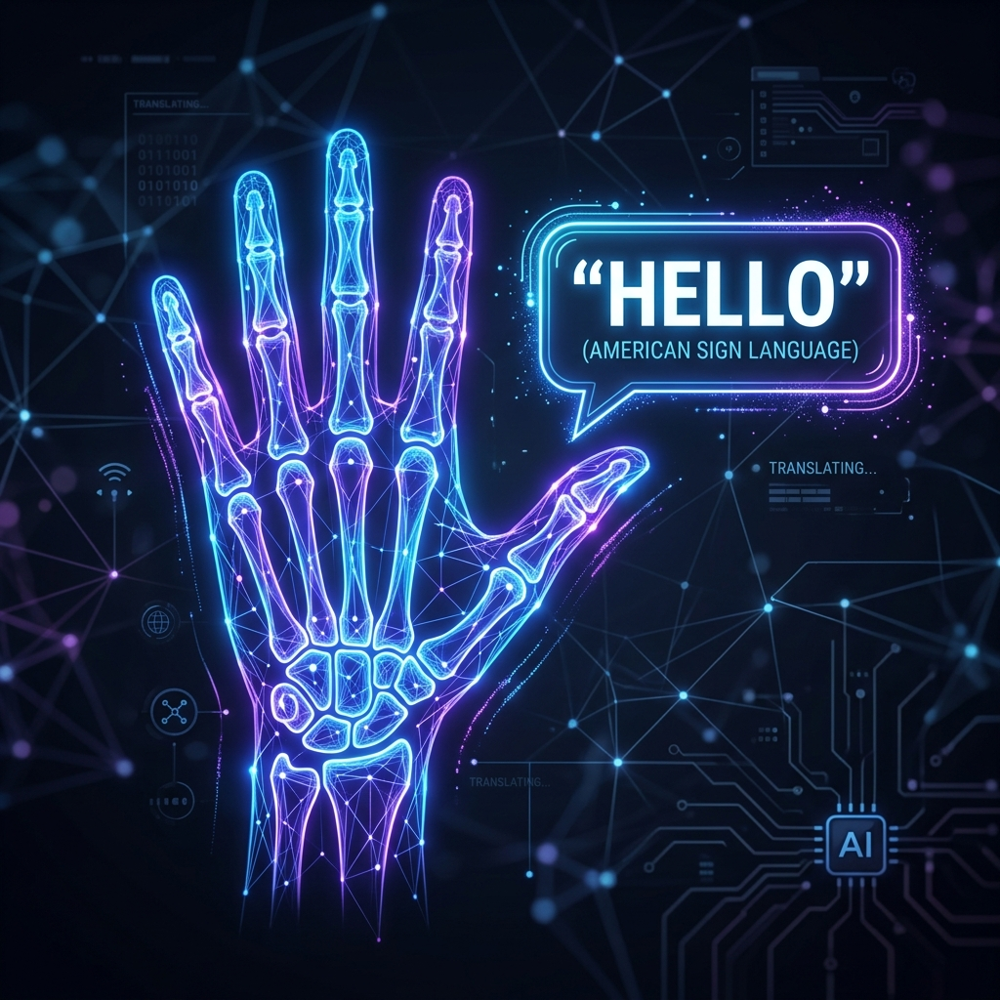
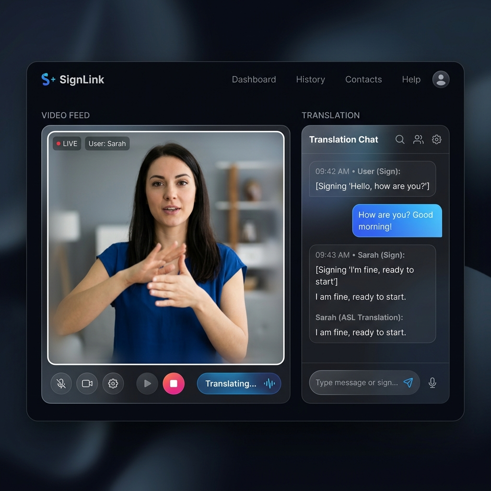

  

# SIGNET: Bridging the Communication Gap with AI

Hey there, welcome to SIGNET!

### The "Why" and "What it Solves"
Imagine you are visiting a foreign country where you don't speak a single word of the local language. To buy a coffee or ask for directions, you have to awkwardly gesture, use translation apps, and hope the other person understands you. It’s frustrating, right? 

Now, imagine experiencing that same frustration every single day, in your own hometown, just to communicate with the barista, the cashier, or your coworkers. That is the reality for millions of people in the deaf and hard-of-hearing community. The world operates in spoken language, creating a massive barrier for those who rely on sign language. 

**That’s exactly what SIGNET solves.**

SIGNET is a real-time translator, but instead of translating Spanish to English, it translates **hand movements into spoken words**. You just open your laptop, turn on the webcam, and start signing. The application instantly reads your gestures and speaks them out loud to the person you are talking to. It’s like having a personal, invisible interpreter standing right next to you!

  

### Project Architecture & Data Flow

To give you a better idea of how everything connects behind the scenes, here is a quick look at the file structure and how data moves through the system.

📂 SIGNET
├── 📄 app.py (The main Flask backend server)
├── 📄 train.py & train_lstm.py (My AI model training scripts)
├── 📄 convert_dataset.py (Utility to process raw data)
└── 📂 frontend_interfaces
    ├── 📂 signer (Webcam capture & gesture transmission)
    └── 📂 receiver (Live translated text & audio playback)

**How the data actually flows when you are using it:**

1. **Capturing the Movement**: It starts in the Signer frontend. Your webcam feed is picked up by the browser, and the system immediately maps out the exact coordinates of your hand joints.
2. **Making the Prediction**: Those coordinate numbers are packaged up and sent over to `app.py`. The Flask server feeds them into the trained AI models to figure out what sign you just made.
3. **Returning the Translation**: The server sends the predicted word or letter back to the Signer interface.
4. **Broadcasting the Message**: Once the Signer interface gets the translation, it pushes the text up to my Supabase database. 
5. **Receiving in Real-Time**: Supabase instantly pings the Receiver frontend using WebSockets. The Receiver's screen updates with the new message, and the browser's Speech API reads it out loud!

### How I Built It (For the Tech-Curious)

I wanted this to be fast and accessible, which meant avoiding heavy, laggy image processing that requires a massive GPU. Instead, the application captures video frames and runs them through Google MediaPipe to map out 21 3D hand landmarks. 

Once those skeletal coordinates are extracted, they get passed into a custom PyTorch model I trained. For static letters and basic alphabets, an Artificial Neural Network does the heavy lifting. For dynamic words and full sentences that involve motion, I implemented an LSTM network to track the sequence of gestures. By working with coordinate vectors instead of raw pixels, the whole system runs incredibly smoothly even on a basic laptop CPU.

### The Real-Time Experience

The application is split into two main views to replicate a real conversation. The "Signer" interface captures the webcam feed and runs the AI inference. As soon as a sign is recognized, the translation is instantly broadcasted over to a connected "Receiver" interface using Supabase Realtime WebSockets. 

It essentially acts like a private, low-latency chat room. The signer gets to communicate naturally, and the receiver gets the translated text right on their screen. I also integrated the Web Speech API and MyMemory API to add text-to-speech and language translation, making the conversation even more seamless. And for privacy, video feeds are never saved anywhere, all processing happens locally in RAM, and messages are locked behind unique session access codes.

### Getting Started

If you want to run this on your own machine, make sure you have Python installed. You can install all the necessary dependencies from the requirements file. After that, you just need to start the Flask backend and open the frontend HTML files in your browser. Generate a room code, pair the signer and receiver interfaces, and you are good to go.

I had a lot of fun putting this together, especially the challenge of optimizing the neural networks for real-time performance. Feel free to dig through the code!
